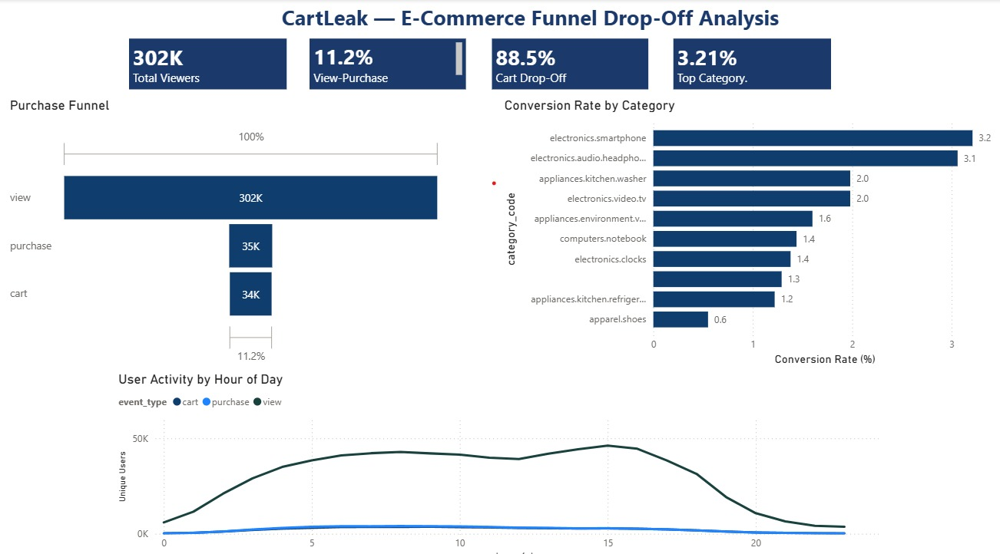

# CartLeak — E-Commerce Funnel Drop-Off Analysis

> Identifying where and why users abandon the purchase journey using 42M behavioural events from a real e-commerce platform.

---

## Project Overview

This project analyses the October 2019 e-commerce events dataset from [REES46](https://www.kaggle.com/datasets/mkechinov/ecommerce-behavior-data-from-multi-category-store) to understand funnel drop-off across three stages: **view → cart → purchase**.

Only **1 in 9 users** who view a product ever buy it. This project finds out where the biggest drop-offs happen — and what to do about them.

---

## Key Findings

| Stage    | Users     | Conversion Rate | Drop-Off |
|----------|-----------|-----------------|----------|
| View     | ~301,710  | 100%            | —        |
| Cart     | ~33,772   | 11.19%          | 88.81%   |
| Purchase | ~34,792   | 11.53%          | 88.47%   |

- **Electronics & smartphones** drive the most traffic and convert at **3.21%** — 6x the store average
- **Apparel.shoes** received 75,000+ views but recorded **zero cart additions** — likely a broken tracking event
- Purchase activity peaks **18:00–21:00**; cart abandonment is highest **10:00–14:00**

---

## Tools Used

| Tool       | Purpose                              |
|------------|--------------------------------------|
| SQLite     | Database storage and querying        |
| DBeaver    | SQL editor and database management   |
| Python     | Data analysis and chart generation   |
| pandas     | Data manipulation                    |
| Plotly     | Funnel chart and line chart          |
| seaborn    | Heatmap visualisation                |
| Power BI   | Interactive dashboard                |
| reportlab  | PDF report generation                |

---

## Files

| File | Description |
|------|-------------|
| `queries.sql` | All 3 SQL queries with comments explaining the logic |
| `cartleak_analysis_v2.ipynb` | Full Python analysis — charts, insights, PDF generation |
| `CartLeak_Report.pdf` | Final one-page PDF report |
| `dashboard.jpeg` | Power BI dashboard screenshot |
| `cartleak_funnel.csv` | Funnel metrics by event type |
| `cartleak_category.csv` | Conversion rates by product category |
| `cartleak_hourly.csv` | User activity broken down by hour |

---

## How to Reproduce

1. Download the dataset from [Kaggle](https://www.kaggle.com/datasets/mkechinov/ecommerce-behavior-data-from-multi-category-store)
2. Import into SQLite using DBeaver
3. Run `queries.sql` to reproduce the core analysis
4. Open `cartleak_analysis_v2.ipynb` in Jupyter to generate charts

---

## Recommendations

| # | Recommendation | Impact |
|---|---------------|--------|
| 1 | Simplify checkout to 3 steps max + enable guest checkout | High |
| 2 | Fix apparel.shoes tracking — zero cart adds on 75K views signals a broken event | High |
| 3 | Double down on smartphones — highest traffic + highest conversion = best ROI | High |
| 4 | Retarget abandoned carts between 18:00–21:00 when purchase intent is highest | Medium |

---

## About

Built by [Pratham Gautam](https://github.com/prathamgautam2410-arch) as a portfolio project demonstrating end-to-end data analysis using SQL, Python, and Power BI.
